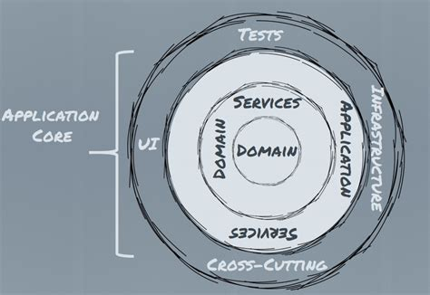

# BW Invoice Module
## Requirements
The Vendors and Account are two important data points for Invoice Processing. 
Instead of requiring manual entry/upload the Vendors' and Accounts' information by our clients, 
it is great feature if we can directly import those data from the system which out clients already used.
The [Xero](https://www.xero.com/ca/) is the first specific platform which we are looking a and integreting in this project.

This current version built the main frame of the system 
and implemented the importing functions below, 
therefore prepared and supports for furthing invoice process development.

* to provide web page to acquire the Xero access permission of the client
* to import the Organization from Xero (our client)
* to import the Vendors of the Organization from Xero
* to import the Accounts of the Organization from Xero

## Deployment Instruction
1. To deploy the application on public site (e.g invoice.beanworks.com)
following Microsoft [ASP.Net Core Deployment](https://docs.microsoft.com/en-us/aspnet/core/host-and-deploy/?view=aspnetcore-2.2)
2. To create a free Xero developer account if you don't have one yet.
3. To create an app on Xero Developer site: https://developer.xero.com/myapps/
* To choose Public App to create
* To input any app name and url you want
* To click `Add an OAuth 1.0a callback domain` with the domain (e.g invoice.beanworks.com) which you deployed on step 1
If you testing in local, you can just type `localhost` 
* To check the agreement and click `Create App`
4. You will see `OAuth 1.0a Credentials` after creating app successful.
5. To copy two fields `Consumer Key` and `Consumer Key` under `OAuth 1.0a Credentials` 
and replace corresponding ones in `appsettings.json` in published folder in step 1.
6. To replace the host part of `CallbackUrl` in `appsettings.json` by the domain you deployed in step 1 (e.g invoice.beanworks.com).
7. To simplify the first version, the database have been hard coded as Sqlite and file location `{published-folder}/Data/Invoice.sqlite`

## Application Guide
1. After deployed as above, when you navigate to the application website, 
you will see the home page, and click the big blue button `Connect to Xero`
2. You will be redirect to the Xero login page if you haven't logged in before
3. To log in by your credential of free developer account or other account you have in Xero
4. After logged in successful, you will see the xero page 
which the application require your authorization to access your Xero data.
5. To choose the organization which you want import data and click `Allow access for 30 mins`
6. You will be redirected back to the application site, and see message `Authorization success`
7. To click `Import Vendors/Accounts`, will import Organization, Vendors, Accounts into database.
8. To check database on published folder `/Data/Invoice.sqlite to see if the data imported or not 

## Architecture and Design
### Brief Instroduction
The system heavily used Dependency Inject to decouple and isolate modules/packages. 
The domain module is the core which included all business logic related concepts 
and defined all infrastructure functions with interfaces. Then all other modules are
consider as implementations or providers of the core functions. 
That is called the Onion Architecture.

Also trying to avoid too many third party dependencies, 
the system still instroduce some of them in order to focus on our own business 
and write clean code.
* XeroApiSDK: although there is some design problem inside of XeroApiSDK, 
but considering quick starting, it is used to authenticate and retrive data from Xero.
And it is isolated in module Invoice.Integration.Xero and can easy be replaced later.
* NHibernate/Fluent NHinberate: used for persistent, with fluent automapping features,
it is almost zero coding on database at all.
* Automapper: used for Xero to Domain, Domain to Domain object mapping, 
reduced duplicated codes and provide flexibly, it is a must-have for the adapter pattern.
* Machine.Specification and NSubstitue(Mocking): although they are only for test projects 
but they are so helpful and make writing tests easier and enjoyful.

More detail see [Development Instruction](#development-instruction)

### Modules/Packages 
There are mainly 4 modules(vs projects): 
* Invoice (as a core domain module): it include domain models and interfaces which representing functions of integration and persistent.
* Invoice UI (as a presentation layer to accept input and render data)
* Invoice.Integration.Xero: implemented Integreation functions(interfaces in domain) by Xero Api SDK.
* Invoice.Persistent.NHibernate: implemented Persistent functions(interfaces in domain) by Fluent NHibernate

The Invoice is the core module which is independent while all other modules depend on it.

## Development Instruction
### Work from Source Code
1. To clone source code from github: git clone https://github.com/SkightTeam/BW.Invoice.git
2. To set Inovice.UI as start up project if it is not yet.
3. To complie and run from local and then follow the application guide.

### Naming Convention
This project used a different naming convention than "standard" C#
* Removed `I` prefix in interface naming to make clean and meaningful codes
* Added `Impl` to the class of the interface if only a single implementation 
or specific provider name for multiple implementations. 

### Dependencies List
#### Main Project's Dependencies
* Xero.Api.Core
* Automapper 8.0.0
* NHibernate / Fluent NHibernate

#### Test Project's Dependencies
* Machine.Specifications 0.12.0
* Machine.Specifications.Should 0.11.0
* Machine.Specifications.Runner.VisualStudio 2.8.0
* Machine.Specifications.Fakes 2.10.0
* Machine.Specifications.Fakes.NSubstitute 2.10.0

Also need install Resharper extension if want to run test from Resharper: machine.specifications.runner.resharper

## Technology Debt
### Test Coverage Low
The purpose of the first version is to set up main framework, 
so not wrote too many unit tests to cover all codes/paths. 
But the DI helped isolated pieces of code, 
that maked it easier to fullfill unit tests later

### Duplicated Code in Public/Parnter Authenticator
The two classes have lots duplicated code, 
which came from Xero.Api two base authenticators design. 
It can be improved by rewrite Xero.Api authenticators's code.

### UserId improper passed in XeroApi
The UserID has been passed through XeroCoreApi down to XeroHttpClient, and finally used to look up token in Token Store.
The whole process is complicated and hidden behavior. Need improve by rework on XeroApi itself.

### Hardcode Database configuration
The database configuration have been hard coded as Sqlite and `Data/invoice.sqlite` for first version.
It can be easy to improve later

### Importing duplicated
Haven't handled the duplicated record by check local repository if it existed before, 
that is catched by `TODO` in import service.
